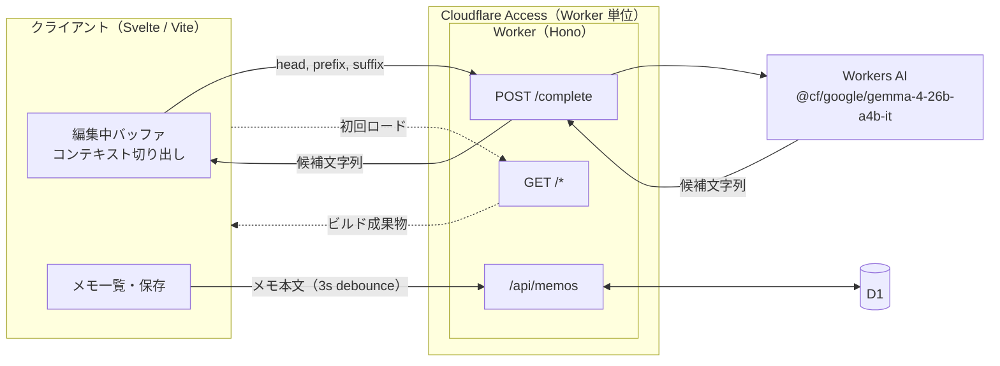
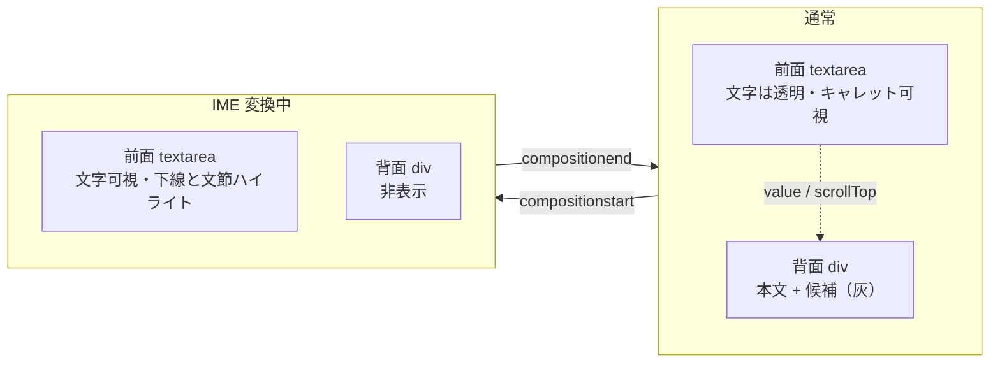
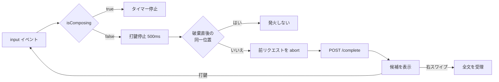

# PoC アーキテクチャ

## 構成



## 補完

### エディタ



### 発火



### コンテキスト

| 要素 | 量 |
|---|---|
| head（メモ冒頭） | 100 字 |
| prefix（カーソル前） | 600 字 |
| suffix（カーソル後） | 200 字 |
| few-shot 例 | 3 例・長さをばらつかせる |
| 出力上限 | 64 tokens |

## 永続化

```sql
CREATE TABLE memos (
  id         TEXT    PRIMARY KEY,
  title      TEXT,                       -- NULL なら body の先頭行を表示名に使う
  body       TEXT    NOT NULL DEFAULT '',
  created_at INTEGER NOT NULL,
  updated_at INTEGER NOT NULL
);

CREATE INDEX idx_memos_updated_at ON memos(updated_at DESC);
```
